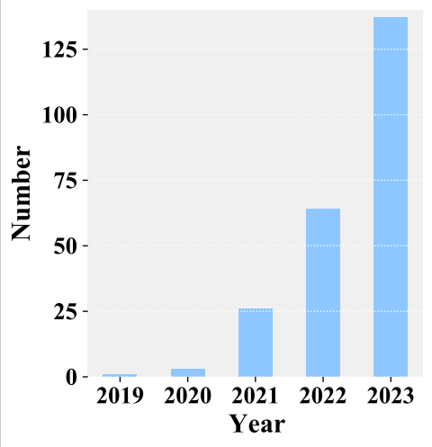
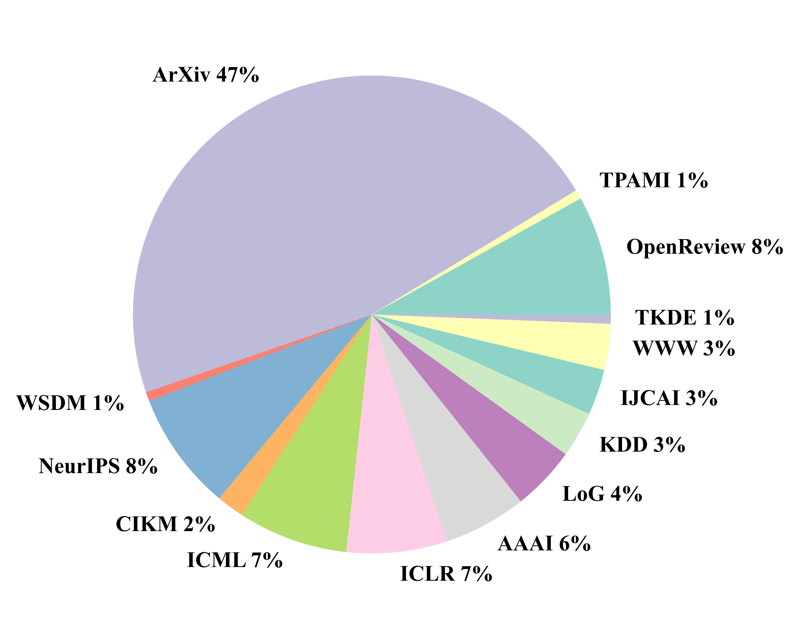
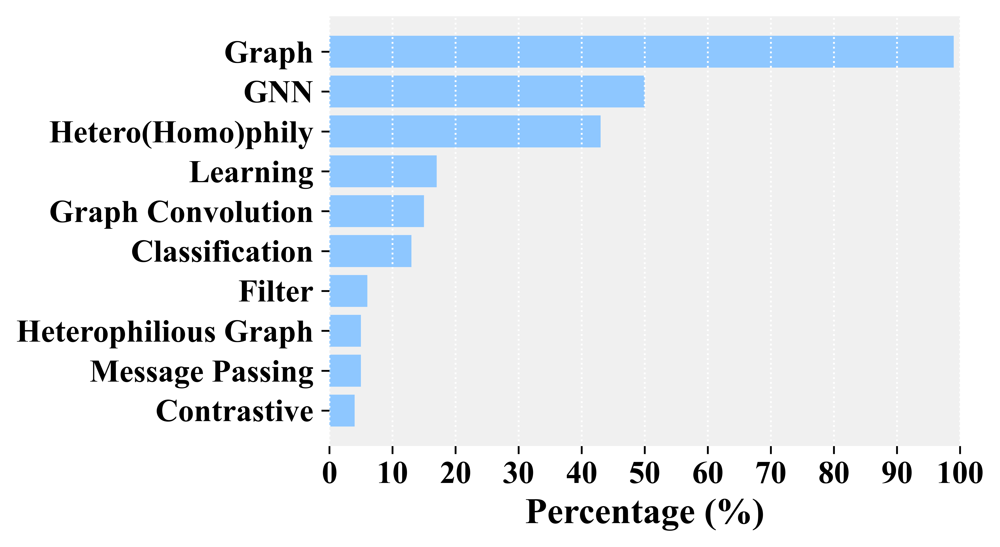

# Learning from Graphs with Heterophily: Progress and Future Directions
   
   

This repository contains a list of the relevant resources on learning on graphs with heterophily. We categorize the following papers based on their published years. We will try our best to continuously maintain this repository  in real time. If you found any error or any missed paper, please don't hesitate to open issues.

# Literature Overview

   

In this survey, we summarize over 180 high-quality papers published in top conferences or journals over the past 5 years including but not limited to ICML, NeurIPS, ICLR, KDD, WWW, TPAMI, etc. To catch up with the frontiers, some latest works on OpenReview and ArXiv are also included. In the above we summarizes the statistics of the collected papers. We see that the number of papers released about heterophilous graph learning has significantly increased in recent three years. Meanwhile, the distribution of collected papers published in major venues is given above. Further, we present the Top-10 keywords that appear in the titles of collected papers.

# Taxonomy
## Learning Strategies
### (Semi-)Supervised Learning

#### Leveraging Adaptive Filters
- [ICLR 2021] **Adaptive Universal Generalized PageRank Graph Neural Network** [[Paper](https://arxiv.org/abs/2006.07988)], [[Code](https://github.com/jianhao2016/GPRGNN)]
- [NeurIPS 2021] **Diverse Message Passing for Attribute with Heterophily** [[Paper](https://openreview.net/forum?id=4jPVcKEYpSZ)], [Code]
- [AAAI 2021] **Beyond Low-frequency Information in Graph Convolutional Networks** [[Paper](https://arxiv.org/abs/2101.00797)], [[Code](https://github.com/bdy9527/FAGCN)]
- [NeurIPS 2022] **Revisiting Heterophily For Graph Neural Networks** [[Paper]](https://arxiv.org/abs/2210.07606), [Code]
  
#### Utilizing Local Neighbors
- [ICML 2019] **MixHop: Higher-Order Graph Convolutional Architectures via Sparsified Neighborhood Mixing** [[Paper](https://arxiv.org/abs/1905.00067)], [[Code](https://github.com/samihaija/mixhop?tab=readme-ov-file)]
- [NeurIPS 2020] **Beyond Homophily in Graph Neural Networks: Current Limitations and Effective Designs**  [[Paper](https://arxiv.org/abs/2006.11468)], [[Code](https://github.com/GemsLab/H2GCN)]
- [NeurIPS 2021] **Universal Graph Convolutional Networks** [[Paper](https://papers.nips.cc/paper/2021/hash/5857d68cd9280bc98d079fa912fd6740-Abstract.html)], [[Code](https://github.com/jindi-tju/U-GCN)]
 
#### Exploring Non-Local Homophily
- [ICLR 2020] **Geom-GCN: Geometric Graph Convolutional Networks** [[Paper](https://arxiv.org/abs/2002.05287)], [[Code](https://github.com/graphdml-uiuc-jlu/geom-gcn)]
- [TPAMI] **Non-Local Graph Neural Networks**  [[Paper](https://arxiv.org/abs/2005.14612)], [[Code](https://github.com/divelab/Non-Local-GNN)]
- [AAAI2022] **Block Modeling-Guided Graph Convolutional Neural Networks** [[Paper](https://arxiv.org/abs/2112.13507)], [[Code](https://github.com/hedongxiao-tju/BM-GCN)]
- [AAAI2022] **Powerful Graph Convolutioal Networks with Adaptive Propagation Mechanism for Homophily and Heterophily** [[Paper](https://arxiv.org/abs/2112.13562)], [[Code](https://github.com/hedongxiao-tju/HOG-GCN)]
- [KDD 2021] **Breaking the Limit of Graph Neural Networks by Improving the Assortativity of Graphs with Local Mixing Patterns** [[Paper](https://arxiv.org/abs/2106.06586)], [[Code](https://github.com/susheels/gnns-and-local-assortativity)]
- [ICML 2022] **Finding Global Homophily in Graph Neural Networks When Meeting Heterophily** [[Paper](https://arxiv.org/abs/2205.07308)], [[Code](https://github.com/recklessronan/glognn)]

#### Modeling Message Passing Process
- [CIKM 2021] **Tree Decomposed Graph Neural Network** [[Paper](https://arxiv.org/abs/2108.11022)], [[Code](https://github.com/YuWVandy/TDGNN)]
- [ICLR 2023] **Ordered GNN: Ordering Message Passing to Deal with Heterophily and Over-smoothing** [[Paper](https://openreview.net/forum?id=wKPmPBHSnT6)], [[Code](https://github.com/LUMIA-Group/OrderedGNN)]
- [ICLR 2023] **ACMP: Allen-Cahn Message Passing with Attractive and Repulsive Forces for Graph Neural Networks**  [[Paper](https://openreview.net/forum?id=4fZc_79Lrqs)], [[Code](https://github.com/ykiiiiii/ACMP)]

#### Rewiring Graph Topology
- [ICLR 2022] **Understanding over-squashing and bottlenecks on graphs via curvature** [[Paper](https://arxiv.org/abs/2111.14522)], [Code]
- [AAAI 2023] **Restructuring Graph for Higher Homophily via Adaptive Spectral Clustering** [[Paper](https://arxiv.org/abs/2206.02386)], [[Code](https://github.com/seanli3/graph_restructure)]
- [ICML 2023] **Finding the Missing-half: Graph Complementary Learning for Homophily-prone and Heterophily-prone Graphs** [[Paper](https://arxiv.org/abs/2306.07608)], [[Code](https://github.com/zyzisastudyreallyhardguy/GOAL-Graph-Complementary-Learning)]

### UnSupervised Learning

#### Contrastive Learning
- [AAAI 2023] **Beyond Smoothing: Unsupervised Graph Representation Learning with Edge Heterophily Discriminating** [[Pdf](https://arxiv.org/abs/2211.14065)], [[Code](https://github.com/yixinliu233/GREET)]
- [CIKM 2023] **MUSE: Multi-View Contrastive Learning for Heterophilic Graphs** [[Paper](https://arxiv.org/abs/2307.16026], [[Code](https://anonymous.4open.science/r/MUSE-BD4B)]
- [ICML 2023] **Half-Hop: A graph upsampling approach for slowing down message passing** [[Paper](https://openreview.net/forum?id=lXczFIwQkv)], [[Code](https://github.com/nerdslab/halfhop)]
- [NeurIPS 2023] **Simple and Asymmetric Graph Contrastive Learning without Augmentations** [[Paper](https://arxiv.org/abs/2310.18884)], [[Code](https://github.com/tengxiao1/GraphACL)]
- [ICML 2023] **Contrastive Learning Meets Homophily: Two Birds with One Stone** [[Paper](https://openreview.net/forum?id=YIcb3pR8ld)], [Code]

#### Generative Learning
- [NeurIPS 2022] **Decoupled Self-supervised Learning for Non-Homophilous Graphs** [[Paper](https://arxiv.org/abs/2206.03601)], [Code]
- [ICLR 2022] **Graph Auto-Encoder Via Neighborhood Wasserstein Reconstruction** [[Paper](https://arxiv.org/abs/2202.09025)], [[Code]](https://github.com/mtang724/NWR-GAE)
- [ICML 2023] **Beyond Homophily: Reconstructing Structure for Graph-agnostic Clustering** [[Paper](https://arxiv.org/abs/2305.02931)], [[Code](https://github.com/Panern/DGCN)]

### Other Learning Strategies
#### Model Robustness Learning
- [NeurIPS 2022] **EvenNet: Ignoring Odd-Hop Neighbors Improves Robustness of Graph Neural Networks** [[Paper](https://arxiv.org/abs/2205.13892)], [Code]
- [KDD 2022] **How does Heterophily Impact Robustness of Graph Neural Networks? Theoretical Connections and Practical Implications** [[Paper](https://arxiv.org/abs/2106.07767)], [[Code](https://github.com/GemsLab/HeteRobust)]
- [ArXiv] **Label Propagation for Graph Label Noise**  [[Paper](https://arxiv.org/pdf/2310.16560)], [Code]

#### Large-scale Graph Learning
- [NeurIPS 2021] **Large Scale Learning on Non-Homophilous Graphs: New Benchmarks and Strong Simple Methods** [[Paper](https://arxiv.org/abs/2110.14446)], [[Code](https://github.com/cuai/non-homophily-large-scale)]
- [NeurIPS 2023] **LD2:Scalable heterophilous graph neural network with decoupled embedding** [[Paper](https://openreview.net/forum?id=7zkFc9TGKz)], [Code]
- [ArXiv] **SIMGA: A Simple and Effective Heterophilous Graph Neural Network with Efficient Global Aggregation** [[Paper](https://arxiv.org/abs/2305.09958)], [Code]

#### Graph Prompt Learning
- [ArXiv] **Prompt Tuning for Multi-View Graph Contrastive Learning**  [[Paper](https://arxiv.org/abs/2310.10362)], [Code]
- [ArXiv] **Enhancing Graph Neural Networks with Structure-Based Prompt**  [[Paper](https://arxiv.org/pdf/2310.17394)], [Code]

## Model Architectures
### Message Passing Based Methods
#### Vanilla MPNNs
- [CIKM 2023] **MUSE: Multi-View Contrastive Learning for Heterophilic Graphs** [[Paper](https://arxiv.org/abs/2307.16026], [[Code](https://anonymous.4open.science/r/MUSE-BD4B)]
- [ICML 2023] **Half-Hop: A graph upsampling approach for slowing down message passing** [[Paper](https://openreview.net/forum?id=lXczFIwQkv)], [[Code](https://github.com/nerdslab/halfhop)]
- [NeurIPS 2023] **Simple and Asymmetric Graph Contrastive Learning without Augmentations** [[Paper](https://arxiv.org/abs/2310.18884)], [[Code](https://github.com/tengxiao1/GraphACL)]

#### Component-enhanced MPNNs
- [TPAMI] **Non-Local Graph Neural Networks**  [[Paper](https://arxiv.org/abs/2005.14612)], [[Code](https://github.com/divelab/Non-Local-GNN)]
- [AAAI2022] **Graph Pointer Neural Networks** [[Paper](https://arxiv.org/abs/2110.00973)], [Code]
- [ICLR 2023] **Gradient Gating for Deep Multi-Rate Learning on Graphs** [[Paper](https://openreview.net/forum?id=JpRExTbl1-)], [Code]

#### Decoupled MPNNs
- [AAAI 2021] **Beyond Low-frequency Information in Graph Convolutional Networks** [[Paper](https://arxiv.org/abs/2101.00797)], [[Code](https://github.com/bdy9527/FAGCN)]
- [ICML 2022] **Finding Global Homophily in Graph Neural Networks When Meeting Heterophily** [[Paper](https://arxiv.org/abs/2205.07308)], [[Code](https://github.com/recklessronan/glognn)]
- [CIKM 2021] **Tree Decomposed Graph Neural Network** [[Paper](https://arxiv.org/abs/2108.11022)], [[Code](https://github.com/YuWVandy/TDGNN)]
- [ICLR 2021] **Adaptive Universal Generalized PageRank Graph Neural Network** [[Paper](https://arxiv.org/abs/2006.07988)], [[Code](https://github.com/jianhao2016/GPRGNN)]
- [ICML 2020] **Simple and Deep Graph Convolutional Networks** [[Paper](https://arxiv.org/abs/2007.02133)]  [[Code](https://github.com/chennnM/GCNII)]
- [ICML 2023] **Towards Deep Attention in Graph Neural Networks: Problems and Remedies** [[Paper](https://arxiv.org/abs/2306.02376)], [[Code](https://github.com/syleeheal/AERO-GNN)]

### Graph Transformer Based Methods
- [NeurIPS 2022] **NodeFormer: A Scalable Graph Structure Learning Transformer for Node Classification** [[Paper](https://proceedings.neurips.cc/paper_files/paper/2022/file/af790b7ae573771689438bbcfc5933fe-Paper-Conference.pdf)], [[Code](https://github.com/qitianwu/NodeFormer)]
- [ICML 2023] **GOAT: A Global Transformer on Large-scale Graphs** [[Paper](https://proceedings.mlr.press/v202/kong23a.html)], [[Code]](https://github.com/devnkong/GOAT.)
- [ArXiv] **SignGT: Signed Attention-based Graph Transformer for Graph Representation Learning**  [[Paper](https://arxiv.org/abs/2310.11025)], [Code]
- [WWW 2023] **Rethinking Structural Encodings: Adaptive Graph Transformer for Node Classification Task** [[Paper](https://dl.acm.org/doi/10.1145/3543507.3583464)], [Code]

## Appilications
### Social Networks
#### Fraud Detection 
- [ArXiv] **Dynamic Relation-Attentive Graph Neural Networks for Fraud Detection**  [[Paper](https://arxiv.org/abs/2310.04171)], [Code]
- [WWW 2022] **H2-FDetector: A GNN-based Fraud Detector with Homophilic and Heterophilic Connections**  [[Paper](https://dl.acm.org/doi/abs/10.1145/3485447.3512195)], [Code]
- [WWW 2023] **Label Information Enhanced Fraud Detection against Low Homophily in Graphs**  [[Paper](https://dl.acm.org/doi/abs/10.1145/3485447.3512195)], [Code]

#### Automated Account Detection
- [ArXiv] **Heterophily-aware Social Bot Detection with Supervised Contrastive Learning**  [[Paper](https://arxiv.org/abs/2306.07478)], [Code]
- [ArXiv] **HOFA: Twitter Bot Detection with Homophily-Oriented Augmentation and Frequency Adaptive Attention**  [[Paper](https://arxiv.org/pdf/2306.12870.pdf)], [Code]
- [ArXiv] **Muti-scale Graph Neural Network with Signed-attention for Social Bot Detection: A Frequency Perspective**  [[Paper](https://arxiv.org/abs/2307.01968)], [Code]

### Spatial Networks
#### Scene Generation
- [CVPR] **GPS-Net: Graph Property Sensing Network for Scene Graph Generation**  [[Paper](https://openaccess.thecvf.com/content_CVPR_2020/html/Lin_GPS-Net_Graph_Property_Sensing_Network_for_Scene_Graph_Generation_CVPR_2020_paper.html)], [Code]
- [CVPR] **Heterophily learning network for scene graph generation**  [[Paper](https://openaccess.thecvf.com/content/CVPR2022/html/Lin_HL-Net_Heterophily_Learning_Network_for_Scene_Graph_Generation_CVPR_2022_paper.html)], [Code]

#### Urban Computation
- [KDD 2023] **Spatial Heterophily Aware Graph Neural Networks** [[Paper](https://arxiv.org/abs/2306.12139)], [[Code](https://github.com/PaddlePaddle/PaddleSpatial/tree/main/research/SHGNN)]

### Biochemical networks
#### Drug Discovery 
- [Nature Communications] **Network-based prediction of drug combinations** [[Paper](https://www.nature.com/articles/s41467-019-09186-x)], [Code]
- [A Drug Combination Prediction Framework Based on Graph Convolutional Network and Heterogeneous Information] **Network-based prediction of drug combinations** [[Paper](https://ieeexplore.ieee.org/abstract/document/9964132)], [Code]
  
#### Gene Regulation
- [ArXiv] **Quadratic Graph Attention Network (Q-GAT) for Robust Construction of Gene Regulatory Networks**  [[Paper](https://arxiv.org/abs/2303.14193)], [Code]

# Papers published per year

## Year 2024
- [CIKM 2024] **HC-GST: Heterophily-aware Distribution Consistency based Graph Self-training** [[Paper](https://arxiv.org/pdf/2407.17787)], [Code]
- [KDD 2024] **AGS-GNN: Attribute-guided Sampling for Graph Neural Networks** [[Paper](https://arxiv.org/pdf/2405.15218)], [Code]
- [KDD 2024] **PolyFormer: Scalable Node-wise Filters via Polynomial Graph Transformer** [[Paper](https://openreview.net/forum?id=vUgeBN7F9l)], [Code]
- [KDD 2024] **The Heterophilic Snowflake Hypothesis:Training and Empowering GNNs for Heterophilic Graphs** [[Paper](https://arxiv.org/pdf/2406.12539)], [Code]
- [ICML 2024] **Cooperative Graph Neural Networks** [[Paper](https://arxiv.org/pdf/2310.01267)], [Code]
- [ICML 2024] **GATE: How to Keep Out Intrusive Neighbors** [[Paper](https://arxiv.org/pdf/2406.00418)], [Code]
- [ICML 2024] **Less is More: on the Over-Globalizing Problem in Graph Transformers** [[Paper](https://arxiv.org/pdf/2405.01102)], [Code]
- [ICML 2024] **Feature Distribution on Graph Topology Mediates the Effect of Graph Convolution: Homophily Perspective** [[Paper](https://arxiv.org/pdf/2402.04621)], [Code]
- [ICML 2024] **Efficient Contrastive Learning for Fast and Accurate Inference on Graphs** [[Paper](https://openreview.net/forum?id=vsy21Xodrt)], [Code]
- [ICML 2024] **Mitigating Oversmoothing Through Reverse Process of GNNs for Heterophilic Graphs** [[Paper](https://arxiv.org/abs/2403.10543)], [Code]
- [ICML 2024] **S3GCL: Spectral, Swift, Spatial Graph Contrastive Learning** [[Paper](https://openreview.net/pdf?id=znKAWRZSF9)], [Code]
- [ICML 2024] **Neurodegenerative Brain Network Classification via Adaptive Diffusion with Temporal Regularization** [[Paper](https://openreview.net/pdf?id=GTnn6bNE3j)], [Code]
- [ICLR 2024] **Affinity-based homophily: can we measure homophily of a graph without using node labels?** [[Paper](https://openreview.net/forum?id=IsdDOrAowN)], [Code]
- [ICLR 2024] **Partitioning Message Passing for Graph Fraud Detection** [[Paper](https://openreview.net/forum?id=tEgrUrUuwA)], [Code]
- [ICLR 2024] **PolyGCL: Graph Contrastive Learning via Learnable Spectral Polynomial Filters** [[Paper](https://openreview.net/forum?id=y21ZO6M86t)], [Code]
- [ICLR 2024] **Polynormer: Polynomial-Expressive Graph Transformer in Linear Time** [[Paper](https://openreview.net/pdf?id=hmv1LpNfXa)], [Code]
- [WWW 2024] **Optimizing Polynomial Graph Filters: A Novel Adaptive Krylov Subspace Approach** [[Paper](https://arxiv.org/pdf/2403.07954)], [Code]
- [WWW 2024] **Disambiguated Node Classification with Graph Neural Networks** [[Paper](https://arxiv.org/pdf/2402.08824.pdf)], [Code]
- [WWW 2024] **Challenging Low Homophily in Social Recommendation** [[Paper](https://browse.arxiv.org/pdf/2401.14606.pdf)], [Code]
- [AAAI 2024] **Revisiting Graph-Based Fraud Detection in Sight of Heterophily and Spectrum** [[Paper](https://ojs.aaai.org/index.php/AAAI/article/view/28773)], [Code]
- [ECML-PKDD 2024] **Self-Pro: A Self-Prompt and Tuning Framework for Graph Neural Networks** [[Paper](https://arxiv.org/abs/2310.10362)], [Code]
- [UAI 2024] **Graph Contrastive Learning under Heterophily via Graph Filters** [[Paper](https://arxiv.org/pdf/2303.06344v2)], [Code]
- [Neural Networks] **DPGCL: Dual pass filtering based graph contrastive learning** [[Paper](https://www.sciencedirect.com/science/article/pii/S0893608024004416)], [Code]
- [Pattern Recognition Letters] **Neighbors selective Graph Convolutional Network for homophily and heterophily** [[Paper](https://www.sciencedirect.com/science/article/pii/S016786552400165X)], [Code]
- [Expert Systems with Applications] **Multi-View Discriminative Edge Heterophily Contrastive Learning Network for Graph Anomaly Detection** [[Paper](https://www.sciencedirect.com/science/article/pii/S0957417424013265)], [Code]
- [Expert Systems with Applications] **KNN-GNN: A powerful graph neural network enhanced by aggregating K-nearest neighbors in common subspace** [[Paper](https://www.sciencedirect.com/science/article/pii/S0957417424010832)], [Code]
- [Knowledge and Information Systems] **SimGCL: graph contrastive learning by finding homophily in heterophily** [[Paper](https://doi.org/10.1007/s10115-023-02022-1)], [Code]
- [ArXiv] **What Is Missing In Homophily? Disentangling Graph Homophily For Graph Neural Networks** [[Paper](https://arxiv.org/abs/2406.18854)], [Code]
- [ArXiv] **Leveraging Contrastive Learning for Enhanced Node Representations in Tokenized Graph Transformers** [[Paper](https://arxiv.org/pdf/2406.19258)], [Code]
- [ArXiv] **NTFormer: A Composite Node Tokenized Graph Transformer for Node Classification** [[Paper](https://arxiv.org/pdf/2406.19249)], [Code]
- [ArXiv] **Node-wise Filtering in Graph Neural Networks: A Mixture of Experts Approach** [[Paper](https://arxiv.org/abs/2406.03464)], [Code]
- [ArXiv] **Heterophily-Aware Fair Recommendation using Graph Convolutional Networks** [[Paper](https://arxiv.org/abs/2402.03365)], [Code]
- [ArXiv] **Self-Attention Empowered Graph Convolutional Network for Structure Learning and Node Embedding** [[Paper](https://arxiv.org/pdf/2403.03465)], [Code]
- [ArXiv] **Learn from Heterophily: Heterophilous Information-enhanced Graph Neural Network** [[Paper](https://arxiv.org/pdf/2403.17351)], [Code]
- [ArXiv] **Link Prediction under Heterophily: A Physics-Inspired Graph Neural Network Approach** [[Paper](https://arxiv.org/pdf/2402.14802)], [Code]
- [ArXiv] **Molecule Generation by Heterophilious Triple Flows** [[Paper](https://openreview.net/forum?id=bZHz9WYs9z)], [Code]
- [ArXiv] **Provable Filter for Real-world Graph Clustering** [[Paper](https://arxiv.org/pdf/2403.03666)], [Code]
- [ArXiv] **Homophily-Related: Adaptive Hybrid Graph Filter for Multi-View Graph Clustering** [[Paper](https://ojs.aaai.org/index.php/AAAI/article/view/29514)], [Code]
- [ArXiv] **HENCLER: Node Clustering in Heterophilous Graphs through Learned Asymmetric Similarity** [[Paper](https://arxiv.org/pdf/2405.17050)], [Code]

## Year 2023

- [ICLR 2023] **Gradient Gating for Deep Multi-Rate Learning on Graphs** [[Paper](https://openreview.net/forum?id=JpRExTbl1-)], [Code]
- [ICLR 2023] **ACMP: Allen-Cahn Message Passing with Attractive and Repulsive Forces for Graph Neural Networks**  [[Paper](https://openreview.net/forum?id=4fZc_79Lrqs)], [[Code](https://github.com/ykiiiiii/ACMP)]
- [ICLR 2023] **Ordered GNN: Ordering Message Passing to Deal with Heterophily and Over-smoothing** [[Paper](https://openreview.net/forum?id=wKPmPBHSnT6)], [[Code](https://github.com/LUMIA-Group/OrderedGNN)]
- [ICLR 2023] **A Critical Look at Evaluation of GNNs Under Heterophily: Are We Really Making Progress?** [[Paper](https://openreview.net/forum?id=tJbbQfw-5wv)], [[Code](https://github.com/yandex-research/heterophilous-graphs)]
- [ICLR 2023] **GReTo: Remedying dynamic graph topology-task discordance via target homophily** [[Paper](https://openreview.net/forum?id=8duT3mi_5n)], [[Code](https://github.com/zzyy0929/ICLR23-GReTo)]
- [ICLR-W 2023] **Projections of Model Spaces for Latent Graph Inference** [[Paper](https://arxiv.org/abs/2303.11754v3)], [Code]

- [NeurIPS 2023] **LD2:Scalable heterophilous graph neural network with decoupled embedding** [[Paper](https://openreview.net/forum?id=7zkFc9TGKz)], [Code]
- [NeurIPS 2023] **Simple and Asymmetric Graph Contrastive Learning without Augmentations** [[Paper](https://arxiv.org/abs/2310.18884)], [[Code](https://github.com/tengxiao1/GraphACL)]

- [ICML 2023] **Characterizing Graph Datasets for Node Classification:Homophily–Heterophily Dichotomy and Beyond** [[Paper](https://arxiv.org/pdf/2209.06177.pdf)], [Code]
- [ICML 2023] **Finding the Missing-half: Graph Complementary Learning for Homophily-prone and Heterophily-prone Graphs** [[Paper](https://arxiv.org/abs/2306.07608)], [[Code](https://github.com/zyzisastudyreallyhardguy/GOAL-Graph-Complementary-Learning)]
- [ICML 2023] **Contrastive Learning Meets Homophily: Two Birds with One Stone** [[Paper](https://openreview.net/forum?id=YIcb3pR8ld)], [Code]
- [ICML 2023] **Beyond Homophily: Reconstructing Structure for Graph-agnostic Clustering** [[Paper](https://arxiv.org/abs/2305.02931)], [[Code](https://github.com/Panern/DGCN)]
- [ICML 2023] **Towards Deep Attention in Graph Neural Networks: Problems and Remedies** [[Paper](https://arxiv.org/abs/2306.02376)], [[Code](https://github.com/syleeheal/AERO-GNN)]
- [ICML 2023] **Half-Hop: A graph upsampling approach for slowing down message passing** [[Paper](https://openreview.net/forum?id=lXczFIwQkv)], [[Code](https://github.com/nerdslab/halfhop)]
- [ICML 2023] **GOAT: A Global Transformer on Large-scale Graphs** [[Paper](https://proceedings.mlr.press/v202/kong23a.html)], [[Code]](https://github.com/devnkong/GOAT.)
- [ICML-W] **Evolving Computation Graphs** [[Paper](https://arxiv.org/abs/2306.12943)], [Code]
  
- [KDD 2023] **Spatial Heterophily Aware Graph Neural Networks** [[Paper](https://arxiv.org/abs/2306.12139)], [[Code](https://github.com/PaddlePaddle/PaddleSpatial/tree/main/research/SHGNN)]
- [KDD-W 2023] **Examining the Effects of Degree Distribution and Homophily in Graph Learning Models** [[Paper](https://arxiv.org/abs/2307.08881)], [[Code](https://github.com/google-research/graphworld)]
- [WWW 2023] **Rethinking Structural Encodings: Adaptive Graph Transformer for Node Classification Task** [[Paper](https://dl.acm.org/doi/10.1145/3543507.3583464)], [Code]
- [WWW 2023] **Addressing Heterophily in Graph Anomaly Detection: A Perspective of Graph Spectrum** [[Paper](https://hexiangnan.github.io/papers/www23-graphAD.pdf)], [Code](https://github.com/blacksingular/GHRN)]
- [WWW 2023] **Homophily-oriented Heterogeneous Graph Rewiring** [[Paper](https://arxiv.org/abs/2302.06299)], [Code]
- [WWW 2023] **Auto-HeG: Automated Graph Neural Network on Heterophilic Graphs** [[Paper](https://arxiv.org/pdf/2302.12357)], [Code]
- [WWW 2023] **Label Information Enhanced Fraud Detection against Low Homophily in Graphs** [[Paper](https://arxiv.org/abs/2302.10407)], [[Code](https://github.com/Orion-wyc/GAGA)]
- [WWW 2023] **SE-GSL: A General and Effective Graph Structure Learning Framework through Structural Entropy Optimization** [[Paper](https://arxiv.org/abs/2303.09778)], [[Code](https://github.com/RingBDStack/SE-GSL)]

- [IJCAI 2023] **LSGNN: Towards General Graph Neural Network in Node Classification by Local Similarity** [[Paper](https://arxiv.org/abs/2305.04225)], [[Code](https://github.com/draym28/LSGNN)]
- [IJCAI 2023] **Graph Neural Convection-Diffusion with Heterophily** [[Paper](https://arxiv.org/abs/2305.16780)], [[Code](https://github.com/zknus/Graph-Diffusion-CDE)]
- [AAAI 2023] **Beyond Smoothing: Unsupervised Graph Representation Learning with Edge Heterophily Discriminating** [[Pdf](https://arxiv.org/abs/2211.14065)], [[Code](https://github.com/yixinliu233/GREET)]
- [AAAI 2023] **Restructuring Graph for Higher Homophily via Adaptive Spectral Clustering** [[Paper](https://arxiv.org/abs/2206.02386)], [[Code](https://github.com/seanli3/graph_restructure)]
- [AAAI-W 2023] **2-hop Neighbor Class Similarity (2NCS): A graph structural metric indicative of graph neural network performance** [[Paper](https://arxiv.org/abs/2212.13202)], [Code]
- [MM 2023] **Multi-modal Social Bot Detection: Learning Homophilic and Heterophilic Connections Adaptively** [[Paper](https://dl.acm.org/doi/abs/10.1145/3581783.3612569)], [Code]

- [CIKM 2023] **Homophily-enhanced Structure Learning for Graph Clustering** [[Paper](https://arxiv.org/abs/2308.05309)], [[Code](https://github.com/galogm/HoLe)]
- [CIKM 2023] **MUSE: Multi-View Contrastive Learning for Heterophilic Graphs** [[Paper](https://arxiv.org/abs/2307.16026], [[Code](https://anonymous.4open.science/r/MUSE-BD4B)]
- [CIKM 2023] **SplitGNN: Spectral Graph Neural Network for Fraud Detection against Heterophily], [[Code](https://dl.acm.org/doi/abs/10.1145/3583780.3615067)]

- [ECML-PKDD 2023] **Leveraging Free Labels to Power up Heterophilic Graph Learning in Weakly-Supervised Settings: An Empirical Study** [[Paper](https://www.springerprofessional.de/leveraging-free-labels-to-power-up-heterophilic-graph-learning-i/26051948)], [Code]
- [ECML-PKDD 2023] **Learning to Augment Graph Structure for both Homophily and Heterophily** [[Paper](https://link.springer.com/chapter/10.1007/978-3-031-43418-1_1)], [[Code](https://github.com/LirongWu/L2A)]
  
- [LoG 2023] **On Performance Discrepancies Across Local Homophily Levels in Graph Neural Networks** [[Paper](https://arxiv.org/abs/2306.05557)], [Code]
  
- [ICME 2023] **Improving the Homophily of Heterophilic Graphs for Semi-Supervised Node Classification** [[Paper](https://www.computer.org/csdl/proceedings-article/icme/2023/689100b865/1PTMICbZ1wQ)], [Code]
- [ACML 2023] **Unleashing the Power of High-pass Filtering in Continuous Graph Neural Networks** [[Paper](https://proceedings.mlr.press/v222/zhang24e.html)], [Code]

- [Neurocomputing] **Signed attention based graph neural network for graphs with heterophily** [[Paper](https://www.sciencedirect.com/science/article/pii/S0925231223008548)], [Code]
- [TKDD] **Multi-View Graph Representation Learning Beyond Homophily** [[Paper](https://arxiv.org/abs/2304.07509)], [[Code](https://github.com/G-AILab/MVGE)]
- [TNNLS] **Exploiting Neighbor Effect: Conv-Agnostic GNNs Framework for Graphs with Heterophily** [[Paper](https://arxiv.org/abs/2203.11200)], [[Code](https://github.com/JC-202/CAGNN)]
- [Data Engineering] [Survey] **Heterophily and Graph Neural Networks: Past, Present and Future** [[Paper](http://sites.computer.org/debull/A23june/p10.pdf)], [Code]
- [Information Sciences] **Taming over-smoothing representation on heterophilic graphs** [[Paper](https://www.sciencedirect.com/science/article/pii/S0020025523010484)], [[Code](https://github.com/KaiGuo20/LE-GNN)]
- [Applied Soft Computing] **Imbalanced node classification with Graph Neural Networks: A unified approach leveraging homophily and label information** [[Paper](https://www.sciencedirect.com/science/article/pii/S1568494623010037)], [Code]

- [OpenReview] **Single-Pass Contrastive Learning Can Work for Both Homophilic and Heterophilic Graph?** [[Paper](https://openreview.net/forum?id=XE0cIoi-sZ1)], [[Code](https://github.com/haonan3/SPGCL)]
- [OpenReview] **Graph Contrastive Learning Under Heterophily: Utilizing Graph Filters to Generate Graph Views** [[Paper](https://openreview.net/forum?id=NzcUQuhEGef)], [Code]
- [OpenReview] **Low-Rank Graph Neural Networks Inspired by the Weak-balance Theory in Social Networks** [[Paper](https://openreview.net/forum?id=ufCQZeAMZzf)], [Code]
- [OpenReview] **Node Classification Beyond Homophily: Towards a General Solution** [[Paper](https://openreview.net/forum?id=kh3JurmKlux)], [Code]
- [OpenReview] **ProtoGNN: Prototype-Assisted Message Passing Framework for Non-Homophilous Graphs** [[Paper](https://openreview.net/forum?id=LeZ39Gkwbi0)], [Code]
- [OpenReview] **From ChebNet to ChebGibbsNet** [[Paper](https://openreview.net/forum?id=2a5Ru3JtNe0)], [Code]
- [OpenReview] **Wide Graph Neural Network** [[Paper](https://openreview.net/forum?id=Ih0fKoIUyEh)], [Code]
- [OpenReview] **SlenderGNN: Accurate, Robust, and Interpretable GNN, and the Reasons for its Success**  [[Paper](https://openreview.net/forum?id=lMgFRIILVB)], [Code]
- [OpenReview] **ReD-GCN: Revisit the Depth of Graph Convolutional Network** [[Paper](https://openreview.net/forum?id=tMg5hKRiW-2)], [Code]
- [OpenReview] **Graph Neural Networks as Gradient Flows: Understanding Graph Convolutions via Energy** [[Paper](https://openreview.net/forum?id=M3GzgrA7U4)], [Code]
- [OpenReview] **Are Graph Attention Networks Attentive Enough? Rethinking Graph Attention by Capturing Homophily and Heterophily** [[Paper](https://openreview.net/forum?id=Xk10fyKR8G)], [Code]
- [OpenReview] **Causally-guided Regularization of Graph Attention improves Generalizability** [[Paper](https://openreview.net/forum?id=U086TJFWy4p)], [Code]

- [ArXiv] **p-Laplacian Transformer** [[Paper](http://arxiv.org/abs/2311.03235)], [Code]
- [ArXiv] **NP^2L: Negative Pseudo Partial Labels Extraction for Graph Neural Networks**  [[Paper](https://arxiv.org/pdf/2310.01098)], [Code]
- [ArXiv] **SignGT: Signed Attention-based Graph Transformer for Graph Representation Learning**  [[Paper](https://arxiv.org/abs/2310.11025)], [Code]
- [ArXiv] **Enhancing Graph Neural Networks with Structure-Based Prompt**  [[Paper](https://arxiv.org/pdf/2310.17394)], [Code]
- [ArXiv] **Contrastive Learning for Non-Local Graphs with Multi-Resolution Structural Views**  [[Paper](https://arxiv.org/abs/2308.10077)], [Code]
- [ArXiv] **Label Propagation for Graph Label Noise**  [[Paper](https://arxiv.org/pdf/2310.16560)], [Code]
- [ArXiv] **Domain-adaptive Message Passing Graph Neural Network** [[Paper](https://arxiv.org/abs/2308.16470)], [[Code](https://github.com/shenxiaocam/DM_GNN)]
- [ArXiv] **Extended Graph Assessment Metrics for Graph Neural Networks** [[Paper](https://arxiv.org/abs/2307.10112)], [Code]
- [ArXiv] **Muti-scale Graph Neural Network with Signed-attention for Social Bot Detection: A Frequency Perspective**  [[Paper](https://arxiv.org/abs/2307.01968)], [Code]
- [ArXiv] **Automated Polynomial Filter Learning for Graph Neural Networks** [[Paper](https://arxiv.org/abs/2307.07956)], [Code]
- [ArXiv] **Frameless Graph Knowledge Distillation** [[Paper](https://arxiv.org/abs/2307.06631)], [[Code](https://github.com/dshi3553usyd/Frameless_Graph_Distillation)]
- [ArXiv] **MUSE: Multi-View Contrastive Learning for Heterophilic Graphs** [[Paper](https://arxiv.org/abs/2307.16026)], [Code]
- [ArXiv] **QDC: Quantum Diffusion Convolution Kernels on Graphs** [[Paper](https://arxiv.org/abs/2307.11234)], [Code]
- [ArXiv] **Diffusion-Jump GNNs: Homophiliation via Learnable Metric Filters** [[Paper](https://arxiv.org/abs/2306.16976)], [Code]
- [ArXiv] **HOFA: Twitter Bot Detection with Homophily-Oriented Augmentation and Frequency Adaptive Attention** [[Paper](https://arxiv.org/abs/2306.12870)], [Code]
- [ArXiv] **Self-supervised Learning and Graph Classification under Heterophily** [[Paper](https://arxiv.org/abs/2306.08469)], [Code]
- [ArXiv] **Heterophily-aware Social Bot Detection with Supervised Contrastive Learning** [[Paper](https://arxiv.org/abs/2306.07478)], [Code]
- [ArXiv] **Truncated Affinity Maximization: One-class Homophily Modeling for Graph Anomaly Detection** [[Paper](https://arxiv.org/abs/2306.00006)], [[Code](https://github.com/mala-lab/TAM-master/)]
- ArXiv] **GPatcher: A Simple and Adaptive MLP Model for Alleviating Graph Heterophily** [[Paper](https://arxiv.org/abs/2306.14340)], [Code]
- [ArXiv] **PathMLP: Smooth Path Towards High-order Homophily** [[Paper](https://arxiv.org/abs/2306.13532)], [Code]
- [ArXiv] **Demystifying Structural Disparity in Graph Neural Networks: Can One Size Fit All?** [[Paper](https://arxiv.org/abs/2306.01323)], [Code]
- [ArXiv] **Permutation Equivariant Graph Framelets for Heterophilous Graph Learning** [[Paper](https://arxiv.org/abs/2306.04265)], [Code]
- [ArXiv] **Edge Directionality Improves Learning on Heterophilic Graphs** [[Paper](https://arxiv.org/abs/2305.10498)], [Code]
- [ArXiv] **Addressing Heterophily in Node Classification with Graph Echo State Networks** [[Paper](https://arxiv.org/abs/2305.08233)], [[Code](https://github.com/dtortorella/addressing-heterophily-gesn)]
- [ArXiv] **A Fractional Graph Laplacian Approach to Oversmoothing** [[Paper](https://arxiv.org/abs/2305.13084)], [[Code](https://github.com/RPaolino/fLode)]
- [ArXiv] **From Latent Graph to Latent Topology Inference: Differentiable Cell Complex Module** [[Paper](https://arxiv.org/abs/2305.16174)], [Code]
- [ArXiv] **SIMGA: A Simple and Effective Heterophilous Graph Neural Network with Efficient Global Aggregation** [[Paper](https://arxiv.org/abs/2305.09958)], [Code]
- [ArXiv] **Self-attention Dual Embedding for Graphs with Heterophily** [[Paper](https://arxiv.org/abs/2305.18385)], [Code]
- [ArXiv] **SIMGA: A Simple and Effective Heterophilous Graph Neural Network with Efficient Global Aggregation** [[Paper](https://arxiv.org/abs/2305.09958)], [Code]
- [ArXiv] **When Do Graph Neural Networks Help with Node Classification: Investigating the Homophily Principle on Node Distinguishability** [[Paper](https://arxiv.org/abs/2304.14274)], [Code]
- [ArXiv] **Imbalanced Node Classification Beyond Homophilic Assumption** [[Paper](https://arxiv.org/abs/2304.14635)], [Code]
- [ArXiv] **Graph Positional Encoding via Random Feature Propagation** [[Paper](https://arxiv.org/abs/2303.02918)], [Code]
- [ArXiv] **Steering Graph Neural Networks with Pinning Control** [[Paper](https://arxiv.org/abs/2303.01265)], [Code]
- [ArXiv] **Contrastive Learning under Heterophily** [[Paper](https://arxiv.org/abs/2303.06344)], [Code]
- [ArXiv] **Attending to Graph Transformers** [Paper](https://arxiv.org/abs/2302.04181)], [[Code](https://github.com/luis-mueller/probing-graph-transformers)]
- [ArXiv] **Heterophily-Aware Graph Attention Network** [[Paper](https://arxiv.org/abs/2302.03228)], [Code]
- [ArXiv] **Semi-Supervised Classification with Graph Convolutional Kernel Machines** [[Paper](https://arxiv.org/abs/2301.13764)], [Code]
- [ArXiv] **A Graph Neural Network with Negative Message Passing for Graph Coloring** [[Paper](https://arxiv.org/abs/2301.11164)], [Code]
- [ArXiv] **Neighborhood Homophily-based Graph Convolutional Network** [[Paper](https://arxiv.org/abs/2301.09851v2)], [Code]
- [ArXiv] **Is Signed Message Essential for Graph Neural Networks?** [[Paper](https://arxiv.org/abs/2301.08918)], [Code]

## Year 2022

- [ICLR 2022] **Graph Auto-Encoder Via Neighborhood Wasserstein Reconstruction** [[Paper](https://arxiv.org/abs/2202.09025)], [[Code]](https://github.com/mtang724/NWR-GAE)
- [ICLR 2022] **Understanding over-squashing and bottlenecks on graphs via curvature** [[Paper](https://arxiv.org/abs/2111.14522)], [Code]
- [ICLR 2022] **Is Homophily A Necessity for Graph Neural Networks?** [[Paper](https://arxiv.org/abs/2106.06134)], [[Code]](https://openreview.net/attachment?id=ucASPPD9GKN&name=supplementary_material)
- [ICLR 2022] **Understanding and Improving Graph Injection Attack by Promoting Unnoticeability** [[Paper](https://arxiv.org/abs/2202.08057)], [[Code](https://github.com/lfhase/gia-hao)]
- [ICLR 2022] **Neural Link Prediction with Walk Pooling** [[Paper](https://arxiv.org/abs/2110.04375)], [[Code](https://github.com/DaDaCheng/WalkPooling)]

- [NeurIPS 2022] **EvenNet: Ignoring Odd-Hop Neighbors Improves Robustness of Graph Neural Networks** [[Paper](https://arxiv.org/abs/2205.13892)], [Code]
- [NeurIPS 2022] **Decoupled Self-supervised Learning for Non-Homophilous Graphs** [[Paper](https://arxiv.org/abs/2206.03601)], [Code]
- [NeurIPS 2022] **NodeFormer: A Scalable Graph Structure Learning Transformer for Node Classification** [[Paper](https://proceedings.neurips.cc/paper_files/paper/2022/file/af790b7ae573771689438bbcfc5933fe-Paper-Conference.pdf)], [[Code](https://github.com/qitianwu/NodeFormer)]
- [NeurIPS 2022] **Simplified Graph Convolution with Heterophily** [[Paper](https://arxiv.org/abs/2202.04139)], [Code]
- [NeurIPS 2022] **Neural Sheaf Diffusion: A Topological Perspective on Heterophily and Oversmoothing in GNNs** [[Paper](https://arxiv.org/abs/2202.04579)], [[Code]](https://github.com/twitter-research/neural-sheaf-diffusion)
- [NeurIPS 2022] **Revisiting Heterophily For Graph Neural Networks** [[Paper]](https://arxiv.org/abs/2210.07606), [Code]
- [NeurIPS-W 2022] **From Local to Global: Spectral-Inspired Graph Neural Networks** [[Paper](https://arxiv.org/abs/2209.12054)], [[Code]](https://github.com/nhuang37/spectral-inspired-gnn)
- [NeurIPS-W 2022] **Complete the Missing Half: Augmenting Aggregation Filtering with Diversification for Graph Convolutional Networks** [[Paper](https://arxiv.org/abs/2008.08844v4)], [Code]

- [ICML 2022] **Finding Global Homophily in Graph Neural Networks When Meeting Heterophily** [[Paper](https://arxiv.org/abs/2205.07308)], [[Code](https://github.com/recklessronan/glognn)]
- [ICML 2022] **How Powerful are Spectral Graph Neural Networks**  [[Paper](https://arxiv.org/abs/2205.11172)], [Code]
- [ICML 2022] **Optimization-Induced Graph Implicit Nonlinear Diffusion** [[Paper](https://arxiv.org/abs/2206.14418)], [[Code](https://github.com/7qchen/GIND)]
- [ICML-W 2022] **Sheaf Neural Networks with Connection Laplacians**  [[Paper](https://arxiv.org/abs/2206.08702)], [Code]

- [KDD 2022] **How does Heterophily Impact Robustness of Graph Neural Networks? Theoretical Connections and Practical Implications** [[Paper](https://arxiv.org/abs/2106.07767)], [[Code](https://github.com/GemsLab/HeteRobust)]
- [KDD-W 2022] **On Graph Neural Network Fairness in the Presence of Heterophilous Neighborhoods** [[Paper](https://arxiv.org/abs/2207.04376)], [Code]

- [WWW 2022] **H2-FDetector: A GNN-based Fraud Detector with Homophilic and Heterophilic Connections**  [[Paper](https://dl.acm.org/doi/abs/10.1145/3485447.3512195)], [Code]
- 
- [IJCAI 2022] **Beyond Homophily: Structure-aware Path Aggregation Graph Neural Network** [[Paper](https://www.ijcai.org/proceedings/2022/310)], [[Code](https://github.com/zjunet/PathNet)]
- [IJCAI 2022] **RAW-GNN: RAndom Walk Aggregation based Graph Neural Network** [[Paper](https://arxiv.org/abs/2206.13953)], [[Code]](https://github.com/jindi-tju/RAWGNN)

- [AAAI2022] **Block Modeling-Guided Graph Convolutional Neural Networks** [[Paper](https://arxiv.org/abs/2112.13507)], [[Code](https://github.com/hedongxiao-tju/BM-GCN)]
- [AAAI2022] **Powerful Graph Convolutioal Networks with Adaptive Propagation Mechanism for Homophily and Heterophily** [[Paper](https://arxiv.org/abs/2112.13562)], [[Code](https://github.com/hedongxiao-tju/HOG-GCN)]
- [AAAI2022] **Deformable Graph Convolutional Networks** [[Paper](https://arxiv.org/abs/2112.14438)], [Code]
- [AAAI2022] **Graph Pointer Neural Networks** [[Paper](https://arxiv.org/abs/2110.00973)], [Code]

- [ICASSP 2022] **Memory-based Message Passing: Decoupling the Message for Propogation from Discrimination** [[Paper](https://arxiv.org/abs/2202.00423)], [[Code]](https://github.com/JC-202/MMP)

- [LoG 2022] **Label-Wise Message Passing Graph Neural Network on Heterophilic Graphs** [[Paper](https://arxiv.org/abs/2110.08128)], [[Code]](https://github.com/EnyanDai/LWGCN)
- [LoG 2022] **Leave Graphs Alone: Addressing Over-Squashing without Rewiring** [[Paper](https://openreview.net/forum?id=vEbUaN9Z2V8)], [Code]
- [LoG 2022] **Global-Local Graph Neural Networks for Node-Classification** [[Paper](https://openreview.net/forum?id=YCgwkDo56q)], [Code]
- [LoG 2022] **GARNET: Reduced-Rank Topology Learning for Robust and Scalable Graph Neural Networks** [[Paper](https://arxiv.org/abs/2201.12741)], [Code]
- [LoG 2022] **DiffWire: Inductive Graph Rewiring via the Lovász Bound** [[Paper](https://proceedings.mlr.press/v198/arnaiz-rodri-guez22a.html)], [[Code]](https://github.com/AdrianArnaiz/DiffWire)
- [LoG 2022] **[Tutorial]** **Graph Rewiring: From Theory to Applications in Fairness** [[Link]](https://ellisalicante.org/tutorials/GraphRewiring), [[Code]](https://github.com/ellisalicante/GraphRewiring-Tutorial)

- [ICDM 2022] **Two Sides of The Same Coin: Heterophily and Oversmoothing in Graph Convolutional Neural Networks** [[Paper](https://arxiv.org/abs/2102.06462)], [Code]
- [ICDM-W 2022] **Improving Your Graph Neural Networks: A High-Frequency Booster** [[Paper](https://arxiv.org/abs/2210.08251)], [[Code]](https://github.com/sajqavril/Complement-Laplacian-Regularization)

- [TMLR] **Unsupervised Network Embedding Beyond Homophily** [[Paper](https://arxiv.org/abs/2203.10866v3)], [[Code](https://github.com/zhiqiangzhongddu/Selene)] 
- [TNNLS] **NCGNN: Node-Level Capsule Graph Neural Network for Semisupervised Classification** [[Paper](https://arxiv.org/abs/2012.03476)], [Code]
- [TKDE] **Beyond Low-pass Filtering: Graph Convolutional Networks with Automatic Filtering** [[Paper](https://arxiv.org/abs/2107.04755)], [[Code](https://github.com/nnzhan/AutoGCN)]

- [ArXiv] **Node-oriented Spectral Filtering for Graph Neural Networks** [[Paper](https://arxiv.org/abs/2212.03654)], [Code]
- [ArXiv] **Revisiting Heterophily in Graph Convolution Networks by Learning Representations Across Topological and Feature Spaces** [[Paper](https://arxiv.org/abs/2211.00565v2)], [[Code]](https://github.com/SresthTosniwal17/HETGCN)
- [ArXiv] **GLINKX: A Scalable Unified Framework For Homophilous and Heterophilous Graphs** [[Paper](https://arxiv.org/abs/2211.00550)], [Code]
- [ArXiv] **Clenshaw Graph Neural Networks** [[Paper](https://arxiv.org/abs/2210.16508)], [Code]
- [ArXiv] **Unifying Label-inputted Graph Neural Networks with Deep Equilibrium Models** [[Paper](https://arxiv.org/abs/2211.10629)], [[Code]](https://github.com/cf020031308/GQN)
- [ArXiv] **Neighborhood Convolutional Network: A New Paradigm of Graph Neural Networks for Node Classification** [[Paper](https://arxiv.org/abs/2211.07845)], [Code]
- [ArXiv] **Enhancing Intra-class Information Extraction for Heterophilous Graphs: One Neural Architecture Search Approach** [[Paper](https://arxiv.org/abs/2211.10990)], [Code]
- [ArXiv] **Transductive Kernels for Gaussian Processes on Graphs** [[Paper](https://arxiv.org/abs/2211.15322)], [Code]
- [ArXiv] **Flip Initial Features: Generalization of Neural Networks for Semi-supervised Node Classification** [[Paper](https://arxiv.org/abs/2211.15081v2)], [Code]
- [ArXiv] **VR-GNN: Variational Relation Vector Graph Neural Network for Modeling both Homophily and Heterophily** [[Paper](https://arxiv.org/abs/2211.14523)], [Code]
- [ArXiv] **GREAD: Graph Neural Reaction-Diffusion Equations** [[Paper](https://arxiv.org/abs/2211.14208)], [Code]
- [ArXiv] **HP-GMN: Graph Memory Networks for Heterophilous Graphs** [[Paper](https://arxiv.org/abs/2210.08195)], [[Code]](https://github.com/junjie-xu/hp-gmn)
- [ArXiv] **When Do We Need GNN for Node Classification?** [[Paper](https://arxiv.org/abs/2210.16979)], [Code]
- [ArXiv] **Break the Wall Between Homophily and Heterophily for Graph Representation Learning** [[Paper](https://arxiv.org/abs/2210.05382)], [Code]
- [ArXiv] **GPNet: Simplifying Graph Neural Networks via Multi-channel Geometric Polynomials** [[Paper](https://arxiv.org/abs/2209.15454)], [Code]
- [ArXiv] **Graph Polynomial Convolution Models for Node Classification of Non-Homophilous Graphs** [[Paper](https://arxiv.org/abs/2209.05020)], [[Code](https://github.com/kishanwn/GPCN)]
- [ArXiv] **Characterizing Graph Datasets for Node Classification: Beyond Homophily-Heterophily Dichotomy** [[Paper](https://arxiv.org/abs/2209.06177)], [Code]
- [ArXiv] **Make Heterophily Graphs Better Fit GNN: A Graph Rewiring Approach** [[Paper](https://arxiv.org/abs/2209.08264)], [Code]
- [ArXiv] **Link Prediction on Heterophilic Graphs via Disentangled Representation Learning** [[Paper](https://arxiv.org/abs/2208.01820)], [[Code](https://github.com/sjz5202/DisenLink)]
- [ArXiv] **What Do Graph Convolutional Neural Networks Learn?** [[Paper](https://arxiv.org/abs/2207.01839)], [Code]
- [ArXiv] **Deformable Graph Transformer** [[Paper](https://arxiv.org/abs/2206.14337)], [Code]
- [ArXiv] **Demystifying Graph Convolution with a Simple Concatenation** [[Paper](https://arxiv.org/abs/2207.12931)], [Code]
- [ArXiv] **Restructuring Graph for Higher Homophily via Learnable Spectral Clustering** [[Paper](https://arxiv.org/abs/2206.02386)], [Code]
- [ArXiv] **Graph Neural Networks as Gradient Flows** [[Paper](https://arxiv.org/abs/2206.10991)], [Code]
- [ArXiv] **Augmentation-Free Graph Contrastive Learning with Performance Guarantee** [[Paper](https://arxiv.org/abs/2204.04874)], [Code]
- [ArXiv] **Simplifying Node Classification on Heterophilous Graphs with Compatible Label Propagation** [[Paper](https://arxiv.org/abs/2205.09389)], [Code]
- [ArXiv] **Revisiting the Role of Heterophily in Graph Representation Learning: An Edge Classification Perspective** [[Paper](https://arxiv.org/abs/2205.11322)], [Code]
- [ArXiv] **ES-GNN: Generalizing Graph Neural Networks Beyond Homophily with Edge Splitting** [[Paper](https://arxiv.org/abs/2205.13700)], [Code]
- [ArXiv] **Graph Representation Learning Beyond Node and Homophily** [[Paper](https://arxiv.org/abs/2203.01564)], [[Code](https://github.com/syvail/PairE-Graph-Representation-Learning-Beyond-Node-and-Homophily)]
- [ArXiv] **Incorporating Heterophily into Graph Neural Networks for Graph Classification** [[Paper](https://arxiv.org/abs/2203.07678)], [[Code](https://github.com/yeweiysh/IHGNN)]
- [ArXiv] **Homophily modulates double descent generalization in graph convolution networks** [[Paper](https://arxiv.org/abs/2212.13069v2)], [Code]
- [ArXiv] **[Survey Paper]** **Graph Neural Networks for Graphs with Heterophily: A Survey**  [[Paper](https://arxiv.org/abs/2202.07082)], [Code]
- [ArXiv] **When Does A Spectral Graph Neural Network Fail in Node Classification?** [[Paper](https://arxiv.org/abs/2202.07902)], [Code]
- [ArXiv] **GSN: A Universal Graph Neural Network Inspired by Spring Network** [[Paper](https://arxiv.org/abs/2201.12994)], [Code]
- [ArXiv] **Graph Decoupling Attention Markov Networks for Semi-supervised Graph Node Classification** [[Paper](https://arxiv.org/abs/2104.13718)], [Code]
- [ArXiv] **Relational Graph Neural Network Design via Progressive Neural Architecture Search** [[Paper](https://arxiv.org/abs/2105.14490)], [Code]

## Year 2021

- [ICLR 2021] **Adaptive Universal Generalized PageRank Graph Neural Network** [[Paper](https://arxiv.org/abs/2006.07988)], [[Code](https://github.com/jianhao2016/GPRGNN)]
- [ICLR 2021] **How to Find Your Friendly Neighborhood: Graph Attention Design with Self-Supervision** [[Paper](https://openreview.net/forum?id=Wi5KUNlqWty)], [[Code](https://github.com/dongkwan-kim/SuperGAT)]

- [NeurIPS 2021] **Large Scale Learning on Non-Homophilous Graphs: New Benchmarks and Strong Simple Methods** [[Paper](https://arxiv.org/abs/2110.14446)], [[Code](https://github.com/cuai/non-homophily-large-scale)]
- [NeurIPS 2021] **Diverse Message Passing for Attribute with Heterophily** [[Paper](https://openreview.net/forum?id=4jPVcKEYpSZ)], [Code]
- [NeurIPS 2021] **Universal Graph Convolutional Networks** [[Paper](https://papers.nips.cc/paper/2021/hash/5857d68cd9280bc98d079fa912fd6740-Abstract.html)], [[Code](https://github.com/jindi-tju/U-GCN)]
- [NeurIPS 2021] **EIGNN: Efficient Infinite-Depth Graph Neural Networks** [[Paper](https://arxiv.org/abs/2202.10720)], [[Code](https://github.com/liu-jc/EIGNN)]
- [NeurIPS 2021] **BernNet: Learning Arbitrary Graph Spectral Filters via Bernstein Approximation** [[Paper](https://arxiv.org/abs/2106.10994)], [[Code](https://github.com/ivam-he/BernNet)]

- [KDD 2021] **Breaking the Limit of Graph Neural Networks by Improving the Assortativity of Graphs with Local Mixing Patterns** [[Paper](https://arxiv.org/abs/2106.06586)], [[Code](https://github.com/susheels/gnns-and-local-assortativity)]

- [AAAI 2021] **Beyond Low-frequency Information in Graph Convolutional Networks** [[Paper](https://arxiv.org/abs/2101.00797)], [[Code](https://github.com/bdy9527/FAGCN)]
- [AAAI 2021] **Graph Neural Networks with Heterophily** [[Paper](https://arxiv.org/abs/2009.13566)], [[Code](https://github.com/GemsLab/CPGNN)]

- [CIKM 2021] **AdaGNN: Graph Neural Networks with Adaptive Frequency Response Filter** [[Paper](https://arxiv.org/abs/2104.12840)], [[Code](https://github.com/yushundong/AdaGNN)]
- [CIKM 2021] **Tree Decomposed Graph Neural Network** [[Paper](https://arxiv.org/abs/2108.11022)], [[Code](https://github.com/YuWVandy/TDGNN)]

- [WSDM 2021] **Node Similarity Preserving Graph Convolutional Networks** [[Paper](https://arxiv.org/abs/2011.09643)], [[Code](https://github.com/ChandlerBang/SimP-GCN)]
- [ICASSP] **Geometric Scattering Attention Networks** [[Paper](https://arxiv.org/abs/2010.15010)], [Code]

- [TPAMI] **Non-Local Graph Neural Networks**  [[Paper](https://arxiv.org/abs/2005.14612)], [[Code](https://github.com/divelab/Non-Local-GNN)]
- [Journal of Physics: Conference Series] **Energy Levels Based Graph Neural Networks for Heterophily** [[Paper](https://iopscience.iop.org/article/10.1088/1742-6596/1948/1/012042/meta)], [Code]

- [ArXiv] **Unifying Homophily and Heterophily Network Transformation via Motifs** [[Paper](https://arxiv.org/abs/2012.11400)], [Code]
- [ArXiv] **SkipNode: On Alleviating Over-smoothing for Deep Graph Convolutional Networks** [[Paper](https://arxiv.org/abs/2112.11628)], [Code]
- [ArXiv] **Simplifying Approach to Node Classification in Graph Neural Networks** [[Paper](https://arxiv.org/abs/2111.06748)], [[Code](https://github.com/sunilkmaurya/FSGNN)]
- [ArXiv] **Is Heterophily A Real Nightmare For Graph Neural Networks To Do Node Classification?** [[Paper](https://arxiv.org/abs/2109.05641)], [Code]
- [ArXiv] **GCN-SL: Graph Convolutional Networks with Structure Learning for Graphs under Heterophily** [[Paper](https://arxiv.org/abs/2105.13795)], [Code]
- [ArXiv] **Beyond Low-Pass Filters: Adaptive Feature Propagation on Graphs** [[Paper](https://arxiv.org/abs/2103.14187)], [Code]
- [ArXiv] **Node2Seq: Towards Trainable Convolutions in Graph Neural Networks** [[Paper](https://arxiv.org/abs/2101.01849)], [Code]

## Year 2020

- [ICLR 2020] **Geom-GCN: Geometric Graph Convolutional Networks** [[Paper](https://arxiv.org/abs/2002.05287)], [[Code](https://github.com/graphdml-uiuc-jlu/geom-gcn)]
  
- [ICML 2020] **Simple and Deep Graph Convolutional Networks** [[Paper](https://arxiv.org/abs/2007.02133)]  [[Code](https://github.com/chennnM/GCNII)]
  
- [NeurIPS 2020] **Beyond Homophily in Graph Neural Networks: Current Limitations and Effective Designs**  [[Paper](https://arxiv.org/abs/2006.11468)], [[Code](https://github.com/GemsLab/H2GCN)]

## Year 2019 

- [ICML 2019] **MixHop: Higher-Order Graph Convolutional Architectures via Sparsified Neighborhood Mixing** [[Paper](https://arxiv.org/abs/1905.00067)], [[Code](https://github.com/samihaija/mixhop?tab=readme-ov-file)]

